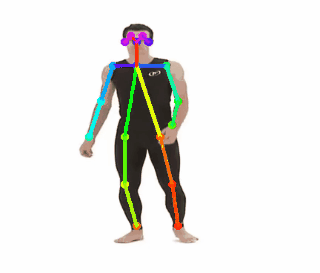

# Partial OpenPose

The purpose of this project is to use [OpenPose](https://github.com/CMU-Perceptual-Computing-Lab/openpose) system capabilities on partial human images.

One of prerequisites of OpenPose system is to have a full body image, since it reconstructs the skeleton based on 16 points which generating the whole body parts. 

This limitation can cause failure in identifying a skeleton where various body parts are missing. The GIF below demonstrate such case:

  
  

    <em>Openpose limitation demonstration</em>
  

Our method is to wisely add the missing body part into the image and then run the OpenPose framework on it.
The result is then manipulated to show the skeleton on the original body.

**The following images show the algorithm flow (left to right):**

1. First a bottom image is given
2. An upper image is matched to the bottom part and a merged image is created
3. OpenPose skeleton is generated to the merged image
4. The skeleton result is reduced to bottom image only

As can be seen below:

  
  

    <em>Algorithm flow from left to right</em>
  

We demonstarte our pruposed method on a video displaying a walking person (legs only).

As can be seen in the following GIFs:

Original Video            |  Skeletonized Video
:-------------------------:|:-------------------------:
 |  

**Project requirements:**

* python 3.5 or above
* numpy
* opencv
* download [tf-pose-estimation](https://github.com/ildoonet/tf-pose-estimation) - release date 16.02.18
* make sure the tf-pose-estimation folder is on the same level of partial-openpose folder
* make sure to change all relative paths

To run the project, use python generate_partial_skeleton_from_video.py

**The code can be found at:** 

<https://github.com/DeJaVoo/partial-openpose>

**Results showing statistics over our training data:**

<https://github.com/DeJaVoo/partial-openpose/blob/master/results.xlsx>

